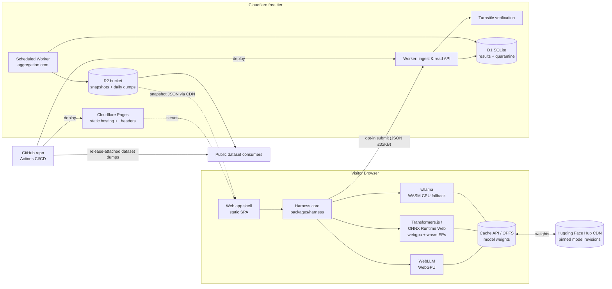

# 03 — System Architecture & Design

**Status:** Approved v1.0 · Changes to §4–§6 require an ADR (§7).

---

## 1. Architecture principles

1. **Static-first.** Everything a visitor touches is static files on a CDN. The only dynamic surface is a tiny ingest/read API. This gives near-infinite read scalability at $0 and a minimal attack surface.
2. **The client is the lab; the server is the librarian.** All measurement happens in the visitor's browser. The server only validates, stores, aggregates on a schedule, and publishes snapshots. The server never computes anything per-visitor-request beyond a key lookup.
3. **Fail open for the user, fail closed for the data.** Backend down → benchmarking still works locally. Suspicious data → quarantined, never silently accepted into aggregates.
4. **One schema, everywhere.** A shared, versioned schema package validates the payload in the browser (before send), at the API (before store), and in analysis jobs (before aggregate).
5. **Everything reproducible from the repo.** Infra is config-in-repo (wrangler.toml, headers files, GitHub Actions). No hand-configured resources.

## 2. System overview



## 3. Component inventory

| ID | Component | Responsibility | Tech | Owner artifact |
|----|-----------|----------------|------|----------------|
| C1 | Web app shell | Routing, UI, consent flow, results card, explorer rendering | Vite + React + TypeScript (strict) | `apps/web` |
| C2 | Harness core | Suite definition loading, orchestration, timing, statistics, crash markers, result assembly. **Framework-agnostic; no React imports.** | TypeScript library | `packages/harness` |
| C3 | Runtime adapters | Uniform interface `RuntimeAdapter { init, generate, embed, dispose, meta }` wrapping WebLLM, Transformers.js, wllama. One adapter per runtime, versioned. | TS, thin wrappers | `packages/harness/adapters/*` |
| C4 | Model & suite registry | Data-only definition of the benchmark matrix: model ids, pinned HF revisions, quants, expected sizes, per-cell timeouts, license metadata, suite version. | JSON + zod schema | `packages/registry` |
| C5 | Shared schema | Zod schemas + generated JSON Schema for: submission payload, API responses, snapshot format, dump rows. Single source of truth. | TS (zod) | `packages/schema` |
| C6 | Ingest/read API | `POST /api/v1/results` (validate → Turnstile check → plausibility gates → insert to `results` or `quarantine`), `GET /r/{id}` data, `GET /api/v1/aggregates` (reads snapshot, not D1). | Cloudflare Worker (Hono) | `apps/api` |
| C7 | Aggregation job | Cron (hourly): recompute cohort aggregates (median, percentiles via exact sort — volumes are small), enforce k≥5, write snapshot JSONs to R2; daily: write Parquet/CSV dumps. | Scheduled Worker; heavy stats in a GitHub-Actions Python job if Worker CPU limits bind (fallback path, same schema) | `apps/api/cron`, `packages/analysis` |
| C8 | Explorer | Filterable views over snapshot JSON; charts. | React + a lightweight chart lib (no heavy deps) | `apps/web/explorer` |
| C9 | Analysis toolkit | Offline notebooks/scripts: bootstrap CIs, poisoning-anomaly review, data-quality dashboards. Not user-facing. | Python + DuckDB | `packages/analysis` |
| C10 | CI/CD | Lint, typecheck, unit, contract, Playwright smoke; deploy Pages+Worker; scheduled uptime probe; dataset release publishing. | GitHub Actions | `.github/workflows` |

## 4. Key data flows

### 4.1 Benchmark run (happy path)
1. UI loads → C2 runs capability probe (FR1) → runnable cells computed from C4 registry.
2. User selects preset → consent for downloads (size shown) → C3 adapter pulls pinned weights from HF (cached in OPFS/Cache API), integrity recorded (FR2.9).
3. C2 executes per `04-benchmark-methodology.md`: warmups, N=3 measured reps, watchdogs, visibility guards; assembles a `ResultDraft` (C5 schema).
4. Results card rendered from `ResultDraft`. Nothing has left the device yet.

### 4.2 Submission
1. User opts in on consent screen (§`06` 5.2) → Turnstile widget token acquired.
2. Client validates payload against C5 schema, POSTs ≤32 KB JSON + token.
3. Worker: schema-validate → verify Turnstile server-side → edge rate-limit check → plausibility gates (`06` §4.3) → insert into `results` (pass) or `quarantine` (soft-fail) → return `result_id`.
4. Next cron: aggregates recomputed → snapshots to R2 → explorer reflects within ≤ 1 h.

### 4.3 Failure paths (must be handled explicitly)
- HF download fails → cell status `download-error`, run continues.
- Adapter init throws / device lost (`GPUDevice.lost` resolves) → status `init-error` with reason string (sanitized).
- Tab killed (OOM) → crash marker flow (FR2.5) on next visit.
- API 4xx (validation) → user sees "couldn't submit (invalid payload)" + local export offered; error logged client-side to the error endpoint (sampled).
- API 5xx / offline → queue + retry (FR3.5).

## 5. Technology decisions (mini-ADRs)

Each entry: **Decision — Rationale — Alternatives rejected — Revisit trigger.**

**5.1 Hosting: Cloudflare Pages (not GitHub Pages).**
Rationale: we require COOP/COEP response headers for cross-origin isolation (WASM threads via SharedArrayBuffer, better timer resolution). GitHub Pages cannot set custom headers; Pages supports a `_headers` file. Also unifies with Workers/D1/R2/Turnstile on one free platform.
Alternatives: GitHub Pages + `coi-serviceworker` shim (rejected: first-load and private-window edge cases undermine measurement consistency); Netlify (fine, but splits the stack).
Revisit if: Cloudflare free-tier terms change materially.
**Consequence for engineers:** the `_headers` file setting `Cross-Origin-Opener-Policy: same-origin` and `Cross-Origin-Embedder-Policy: require-corp` is part of the app's correctness. All cross-origin subresources (HF weights) must be fetched CORS-enabled; verify `crossOriginIsolated === true` in CI smoke.

**5.2 Backend: Cloudflare Worker + Hono + D1 + R2 (not a VM).**
Rationale: zero server maintenance (constraint C2), generous free quotas, edge rate limiting for free, D1 is plenty for ~KB-sized rows, R2 has no egress fees for snapshot/dump serving.
Alternatives: Oracle Cloud always-free ARM VM + FastAPI + Postgres (rejected for v1: patching, uptime, and backup burden on a bus-factor-1 team; documented as the Phase-4 escape hatch in `07` §5); Supabase (fine, second choice).
Revisit if: monthly submissions exceed ~50% of any D1/Worker free quota (`07` §2).

**5.3 Frontend: Vite + React + TS strict (not Next.js/SvelteKit).**
Rationale: pure static output, no server rendering to reason about, largest contributor familiarity pool, trivially hostable anywhere. Harness (C2) stays framework-free so the UI choice is reversible.
Alternatives: SvelteKit (nice, smaller ecosystem for contributors), Next static export (framework weight without benefit here).

**5.4 Runtimes in v1: WebLLM, Transformers.js (ONNX Runtime Web), wllama.**
Rationale: WebLLM = the WebGPU LLM reference; Transformers.js = broadest task coverage (embeddings, ASR) with both webgpu and wasm EPs; wllama = llama.cpp WASM for the universal CPU fallback so *every* visitor produces at least one LLM datapoint.
Rule: adapter versions are pinned exactly; a runtime upgrade is a registry change + ADR + suite minor bump (results tagged with runtime version regardless).

**5.5 Model registry v1 (data, not code): ≤ 8 configurations.**
Tier-0 always-runnable set (quick preset): MiniLM-class embedding model (Apache-2.0); SmolLM2-360M-Instruct q4 (Apache-2.0); Whisper-tiny (MIT) for ASR (S-priority, can slip).
Tier-1: SmolLM2-1.7B-Instruct or Qwen2.5-1.5B-Instruct (Apache-2.0) in q4f16 **and** q4f32 (to expose the shader-f16 split).
Tier-2 (opt-in, big-download warning): one ~3B q4f16.
Rationale: permissive licenses only (constraint C4); small tiers maximize completion rate; the f16/f32 pair is the single most decision-relevant comparison for developers. Exact ids + pinned revisions live in `packages/registry` with license fields; verify licenses at implementation.

**5.6 Where benchmarks execute: Web Worker preferred, main thread fallback.**
Rationale: isolate measurement from UI jank. WebGPU-in-worker support varies by browser/runtime; the adapter meta declares `supportsWorker`, harness falls back to main thread and records `execution_context: "main" | "worker"` as a result dimension (it can affect numbers — never mix silently).

**5.7 Timing: `performance.now()` bracketing + runtime-reported counters, cross-checked.**
Rationale: runtimes report token counts/timings differently; we standardize on our own wall-clock brackets around adapter callbacks, and store the runtime's self-reported stats alongside for cross-validation. Timer resolution is ~100 µs when cross-origin-isolated (our hosting guarantees it); still, all reported metrics are ≥ millisecond-scale by design. GPU `timestamp-query` is recorded when available but is supplementary, never required.

**5.8 Statistics in aggregates: exact medians/percentiles per cohort, computed in cron over full cohort arrays.**
Rationale: volumes are tiny by data-engineering standards (thousands of rows); exactness beats streaming approximations, and median-based aggregates are our first poisoning defense. If cohort arrays ever exceed Worker memory comfort (~100k rows/cohort), switch to t-digest — pre-agreed, no debate later.

**5.9 No third-party scripts, no analytics SDKs.**
Rationale: privacy promise (`06`), CSP simplicity, and measurement purity (an analytics script competing for the main thread corrupts benchmarks). Usage insight comes from Cloudflare's edge request analytics (aggregate, no client code) + our own submitted-results counts.

## 6. Repository structure (monorepo, pnpm workspaces)

```
webai-bench/
├── apps/
│   ├── web/                  # C1, C8 — Vite React app (static)
│   │   └── public/_headers   # COOP/COEP — do not remove (ADR 5.1)
│   └── api/                  # C6, C7 — Cloudflare Worker (Hono) + cron
│       └── wrangler.toml     # bindings: D1, R2, Turnstile secret
├── packages/
│   ├── harness/              # C2, C3 — framework-free measurement core
│   │   ├── src/adapters/     # webllm.ts, transformersjs.ts, wllama.ts
│   │   ├── src/probe.ts      # FR1
│   │   ├── src/runner.ts     # orchestration, watchdogs, visibility, markers
│   │   └── src/stats.ts      # medians, IQR, flags
│   ├── registry/             # C4 — suite + model registry JSON + schema
│   ├── schema/               # C5 — zod source of truth, JSON Schema export
│   └── analysis/             # C9 — python/duckdb offline jobs & notebooks
├── docs/                     # this documentation set + /adr/
│   └── adr/                  # 0001-hosting.md, 0002-… (template below)
├── .github/workflows/        # ci.yml, deploy.yml, uptime.yml, dataset-release.yml
├── SECURITY.md  CONTRIBUTING.md  LICENSE  CODE_OF_CONDUCT.md
└── pnpm-workspace.yaml
```

Dependency rule (enforced by lint): `apps/*` may import `packages/*`; `packages/harness` may import only `registry` and `schema`; `packages/schema` imports nothing internal. Never the reverse.

## 7. ADR process (lightweight, mandatory)

Any change to: methodology (`04`), schemas (C5), registry contents, hosting/backend choices, or security controls → open a PR adding `docs/adr/NNNN-title.md`:

```
# NNNN — Title
Status: Proposed | Accepted | Superseded by NNNN
Context:    (what forces are at play — 3–6 sentences)
Decision:   (what we will do — 1–3 sentences, imperative)
Consequences: (what becomes easier/harder; migrations required)
Alternatives considered: (bullet list with one-line rejections)
```

Lead approval merges it. The Decision Log below indexes accepted ADRs.

## 8. Decision log (open items at v1.0)

| # | Decision | Status | Deadline |
|---|----------|--------|----------|
| D1 | Final product name + domain | Open | Before Phase-1 public post |
| D2 | Include Whisper-tiny ASR in Phase 1 or slip to Phase 3 | Open | End of Phase 0 |
| D3 | Tier-2 (~3B) model in v1 or defer | Open | End of Phase 1 |
| D4 | Turnstile on submit vs. proof-of-work fallback if Turnstile UX hurts opt-in | Open (default: Turnstile) | Phase-2 design review |
| D5 | Chrome built-in AI (Gemini Nano Prompt API) as a measured runtime | Deferred to post-v1 (no downloads to measure; different comparability class) | — |
